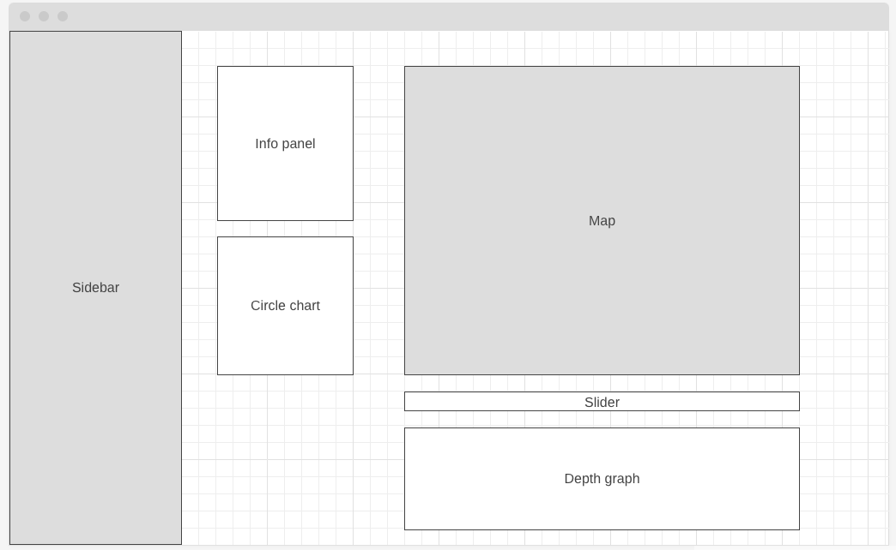
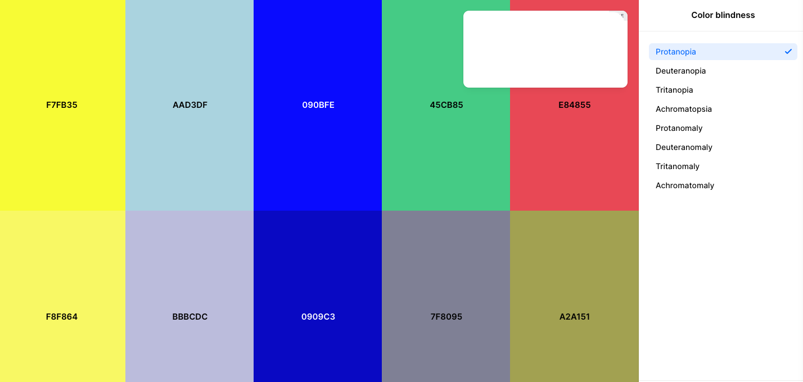
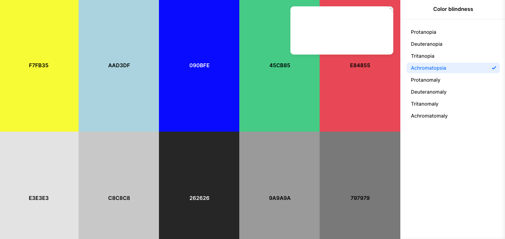

# FishWatch

This is **FishWatch**, an interactive data visualization to explore fish behavior in a waterbody. Movement patterns are represented as a heatmap view of position points with optional animated pathing. You can view movement patterns of all tagged fish, all fish in one species, or one specific fish and fish are color coded based on whether they reached the Final Collection Point or not.

## To run this program

1. `pnpm i`
2. `pnpm run dev`

## Technologies Used

- React, Vite, TypeScript, TailwindCSS
- React Leaflet, ReCharts, GeographicLib

## Data

### Data Assumptions:

MSE:
| Since MSE is a measure of the accuracy of the position estimate, I opted to remove data points with high MSE values. As the position data was given in coordinates, I removed data points with an MSE > 4 thinking this would remove points which were more than 2 units 'off'. This was included in the csvToJson.py script and the accepted MSE value can be easily changed to better represent the data.

### Data Processing

- Position Coordinates:
  - I processed position points to find the farthest distance away from the origin to determine distance the scale to fit in the chosen map area
  - While I converted the given x and y local coordinates into latitudes and longitudes, I preserved the original values for potential use with depth measurement to make a 3D representation of depth over the given area
- Processed release and collection data to find corresponding tag codes to retrieve collection status and species name to aggregate into primary data file (fishMap.json)

| _One significant learning moment at this stage was when I tried to commit and push the large data files. I did not fix the problem right after that commit (the primary mistake ;-;) so a few commits later I needed to go back and sort things out - ultimately, I sought help from a senior engineer who has more Git experience and was able to remove the files from the bad commit._ |

### Data Structure

Primary data file was fishMap.json, I wanted the keys to be the acoustic tag codes for faster lookup, and positions array made plotting point markers and pathing easier.

```json
fishMap.json
	{ AcousticTagCode:  {
			"positions": [
					{ "dateTime": string,
						"lat": number,
						"lon": number,
						"mse": string,
						"x": string,
						"y": string,
						"z": string
					},
				],
			"species": string,
			"collected": boolean,
			"pitTagCode": string
			},
	}
```

```json
data_collection.json
[ { "Tag Code": string,
	"Site Name" : string,
	"Detection Time" : string,
	"Antenna Group Name": string
	},
]
```

```json
data_release.json
[ { "Tag Code": string,
	"Acoustic Tag" : string,
	"Release Date" : string,
	"Species Name": string
	},
]
```

```json
speciesToTag.json
{ Species Name: [
	Tag Code,
	...,
	],
}
```

## Current Features

- **Details Panel** - Provides more information about the selected fish and includes the original number of position points vs the number displayed (see Map Panel details below about random sampling) - PieChart is a better visual representation of the proportion of collected vs non collected fish. When "All" fish are selected it shows data for all released fish. - Legend - Map legend for clarity on color and symbol meanings
- **Map Panel**
  - Leaflet map container with a large marker to show the origin of the local system.
  - Full screen loading state communicates status with the user.
  - Random Sampling: For mapping points, I implemented random sampling to limit the number of points being plotted to around 20,000. This vastly improved performance but also greatly cut down the amount of some position data.
  - Heatmap view:
    - Performs well for all data with random sampling but may be limiting for full dataset exploration: samples on render
  - Trail mode view:
    - Mode can be enabled and disabled which controls access to time slider and is indicated with styling
    - Position points are always shown to improve to overall movement pattern observation

## Layout and Design

Primary considerations for layout and design were to keep focus on data and usability with minimalist design and to test color palette for accessibility and readability.

Primary color palette

Map color testing examples



## Future Features and Improvements

- **UI Features:**
  - **User select:**
    - map colors with options for symbols instead of colors
    - timer interval speed
    - multiple fish (not 1 vs entire species) and filter tag codes by search
  - **Map:**
    - Improved pathing/drift markers for easier multi-fish viewing
    - Depth graph/three point cloud -> highlighting current point on map
- **Data:**
  - Use full datetime to show fish movement more clearly and accurately, rather than all at once
  - Process position data for comparable points/time (some fish collected every 3s others 90s etc)
  - Not bundling data with project
- **Development:**
  - Testing - especially if data was not bundled with project
  - Break more parts of App into components for ease of use and readability

## References

Fullscreen loading: https://tailwindflex.com/prajwal/loading-overlay
